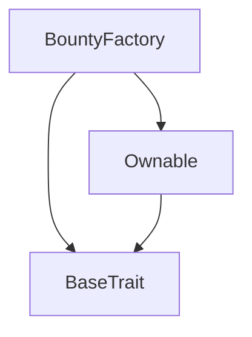
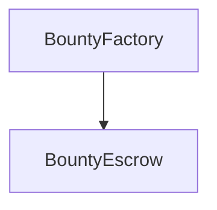

# Tact compilation report
Contract: BountyFactory
BoC Size: 6192 bytes

## Structures (Structs and Messages)
Total structures: 22

### DataSize
TL-B: `_ cells:int257 bits:int257 refs:int257 = DataSize`
Signature: `DataSize{cells:int257,bits:int257,refs:int257}`

### SignedBundle
TL-B: `_ signature:fixed_bytes64 signedData:remainder<slice> = SignedBundle`
Signature: `SignedBundle{signature:fixed_bytes64,signedData:remainder<slice>}`

### StateInit
TL-B: `_ code:^cell data:^cell = StateInit`
Signature: `StateInit{code:^cell,data:^cell}`

### Context
TL-B: `_ bounceable:bool sender:address value:int257 raw:^slice = Context`
Signature: `Context{bounceable:bool,sender:address,value:int257,raw:^slice}`

### SendParameters
TL-B: `_ mode:int257 body:Maybe ^cell code:Maybe ^cell data:Maybe ^cell value:int257 to:address bounce:bool = SendParameters`
Signature: `SendParameters{mode:int257,body:Maybe ^cell,code:Maybe ^cell,data:Maybe ^cell,value:int257,to:address,bounce:bool}`

### MessageParameters
TL-B: `_ mode:int257 body:Maybe ^cell value:int257 to:address bounce:bool = MessageParameters`
Signature: `MessageParameters{mode:int257,body:Maybe ^cell,value:int257,to:address,bounce:bool}`

### DeployParameters
TL-B: `_ mode:int257 body:Maybe ^cell value:int257 bounce:bool init:StateInit{code:^cell,data:^cell} = DeployParameters`
Signature: `DeployParameters{mode:int257,body:Maybe ^cell,value:int257,bounce:bool,init:StateInit{code:^cell,data:^cell}}`

### StdAddress
TL-B: `_ workchain:int8 address:uint256 = StdAddress`
Signature: `StdAddress{workchain:int8,address:uint256}`

### VarAddress
TL-B: `_ workchain:int32 address:^slice = VarAddress`
Signature: `VarAddress{workchain:int32,address:^slice}`

### BasechainAddress
TL-B: `_ hash:Maybe int257 = BasechainAddress`
Signature: `BasechainAddress{hash:Maybe int257}`

### ChangeOwner
TL-B: `change_owner#819dbe99 queryId:uint64 newOwner:address = ChangeOwner`
Signature: `ChangeOwner{queryId:uint64,newOwner:address}`

### ChangeOwnerOk
TL-B: `change_owner_ok#327b2b4a queryId:uint64 newOwner:address = ChangeOwnerOk`
Signature: `ChangeOwnerOk{queryId:uint64,newOwner:address}`

### SubmitProof
TL-B: `submit_proof#143ea1ba proofUrl:^string = SubmitProof`
Signature: `SubmitProof{proofUrl:^string}`

### ApproveSubmission
TL-B: `approve_submission#685a38b6 submissionId:int257 = ApproveSubmission`
Signature: `ApproveSubmission{submissionId:int257}`

### RejectSubmission
TL-B: `reject_submission#920c0b5a submissionId:int257 = RejectSubmission`
Signature: `RejectSubmission{submissionId:int257}`

### SelectWinners
TL-B: `select_winners#cf6ffcfd count:int257 winnerIds:dict<int, address> = SelectWinners`
Signature: `SelectWinners{count:int257,winnerIds:dict<int, address>}`

### CancelBounty
TL-B: `cancel_bounty#06a68ba9  = CancelBounty`
Signature: `CancelBounty{}`

### WithdrawExcess
TL-B: `withdraw_excess#5384f23e  = WithdrawExcess`
Signature: `WithdrawExcess{}`

### Submission
TL-B: `_ id:int257 submitter:address proofUrl:^string submittedAt:int257 approved:bool = Submission`
Signature: `Submission{id:int257,submitter:address,proofUrl:^string,submittedAt:int257,approved:bool}`

### BountyEscrow$Data
TL-B: `_ owner:address title:^string description:^string bountyType:^string poolAmount:int257 winnerCount:int257 perWinnerAmount:int257 platformFeeBps:int257 platformAddress:address winnerSelection:^string verification:^string verificationRule:^string createdAt:int257 durationSeconds:int257 reviewWindowSeconds:int257 endsAt:int257 reviewEndsAt:int257 status:^string submissions:dict<int, ^Submission{id:int257,submitter:address,proofUrl:^string,submittedAt:int257,approved:bool}> submissionCount:int257 nextSubmissionId:int257 winners:dict<int, address> winnerCountFinal:int257 payoutDone:bool = BountyEscrow`
Signature: `BountyEscrow{owner:address,title:^string,description:^string,bountyType:^string,poolAmount:int257,winnerCount:int257,perWinnerAmount:int257,platformFeeBps:int257,platformAddress:address,winnerSelection:^string,verification:^string,verificationRule:^string,createdAt:int257,durationSeconds:int257,reviewWindowSeconds:int257,endsAt:int257,reviewEndsAt:int257,status:^string,submissions:dict<int, ^Submission{id:int257,submitter:address,proofUrl:^string,submittedAt:int257,approved:bool}>,submissionCount:int257,nextSubmissionId:int257,winners:dict<int, address>,winnerCountFinal:int257,payoutDone:bool}`

### CreateBounty
TL-B: `create_bounty#95a02766 title:^string description:^string bountyType:^string winnerCount:int257 winnerSelection:^string verification:^string verificationRule:^string = CreateBounty`
Signature: `CreateBounty{title:^string,description:^string,bountyType:^string,winnerCount:int257,winnerSelection:^string,verification:^string,verificationRule:^string}`

### BountyFactory$Data
TL-B: `_ owner:address platformFeeBps:int257 platformAddress:address bountyCount:int257 bounties:dict<int, address> = BountyFactory`
Signature: `BountyFactory{owner:address,platformFeeBps:int257,platformAddress:address,bountyCount:int257,bounties:dict<int, address>}`

## Get methods
Total get methods: 5

## bountyCount
No arguments

## platformFeeBps
No arguments

## platformAddress
No arguments

## bountyAddress
Argument: index

## owner
No arguments

## Exit codes
* 2: Stack underflow
* 3: Stack overflow
* 4: Integer overflow
* 5: Integer out of expected range
* 6: Invalid opcode
* 7: Type check error
* 8: Cell overflow
* 9: Cell underflow
* 10: Dictionary error
* 11: 'Unknown' error
* 12: Fatal error
* 13: Out of gas error
* 14: Virtualization error
* 32: Action list is invalid
* 33: Action list is too long
* 34: Action is invalid or not supported
* 35: Invalid source address in outbound message
* 36: Invalid destination address in outbound message
* 37: Not enough Toncoin
* 38: Not enough extra currencies
* 39: Outbound message does not fit into a cell after rewriting
* 40: Cannot process a message
* 41: Library reference is null
* 42: Library change action error
* 43: Exceeded maximum number of cells in the library or the maximum depth of the Merkle tree
* 50: Account state size exceeded limits
* 128: Null reference exception
* 129: Invalid serialization prefix
* 130: Invalid incoming message
* 131: Constraints error
* 132: Access denied
* 133: Contract stopped
* 134: Invalid argument
* 135: Code of a contract was not found
* 136: Invalid standard address
* 138: Not a basechain address
* 7084: Not active/review
* 27493: Not in review
* 35499: Only owner
* 36859: Bounty ended
* 38675: Not manual selection
* 39632: Not in review period
* 40269: Review window not over
* 41471: Must have at least 1 winner
* 51182: Invalid selection
* 52330: Per-winner payout too low
* 56464: Already paid out
* 58441: Can only cancel active bounty
* 58786: Payout not done
* 60441: Submission not found
* 63248: Invalid verification
* 63984: Bounty not active

## Trait inheritance diagram

## Contract dependency diagram

